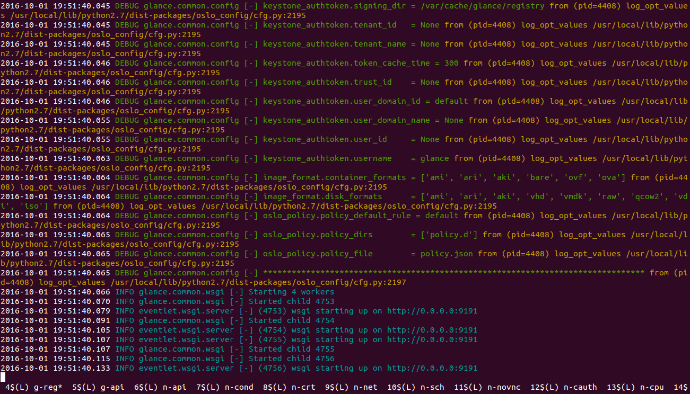
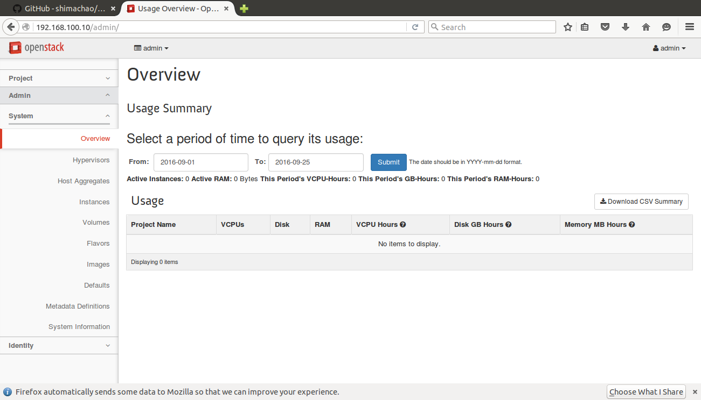

# 安装
***
安装 Cloudlet 需要先部署好 OpenStack，并在部署好的 OpenStack 上安装一个扩展。而部署 OpenStack 是一个复杂得过程，对电脑主机性能和网络环境都有一定的要求。

## 准备好硬件环境
搭建好 Cloudlet 测试环境，你需要准备一下环境
- 一个 U 盘或移动硬盘，供备份源码或配置文件用。
- 一台性能较好的电脑主机。
- 一个局域网环境，且局域网能连通外网。
- 将电脑主机连接到局域网中，并为其分配固定的 IP 地址。
- 在局域网内预留一段 IP 地址给供后面测试用。

电脑主机最好 4G 以上内存、多核 CPU、固态硬盘、两块网卡。本人在一台 4G 内存的 ThinkPad E40 笔记本上安装好 OpenStack 后，刚运行起来就卡死了。所以内存必须得 4G 以上。固态硬盘是为了加快安装系统和软件的速度。至于双网卡是为了后面网络设置方便。只有一张网卡也行。

## 准备好操作系统
在电脑主机上安装好 Ubuntu 14.04 LTS x64，可以是桌面版，也可以是服务器版，本人安装的是桌面版。Cloudlet 依赖于 Ubuntu 提供的一些软件包，所以必须在 Ubuntu 上安装。而且原作者只在 Ubuntu 14.04 x64 上做了测试。

## 准备好软件环境
1. 替换 Ubuntu 软件源

由于安装过程中需要到 Ubuntu 软件仓库下载大量的软件包，Ubuntu 系统默认的软件源在国外，往往会因为网速问题而导致失败。所以我们可以将 Ubuntu 的软件源替换为国内源。如果你所在的局域网环境搭建好了自己的 Ubuntu 源就更好了。我所在的环境离西电开源社区的软件源更近，所以下面以西电开源社区的源为例来说明。
编辑 /etc/apt/sources.list
```shell
~$ sudo gedit /etc/apt/sources.list
```
将 /etc/apt/sources.list 中的内容替换为下面的西电开源社区的源地址：
```
deb http://ftp.xdlinux.info/ubuntu/ trusty main restricted universe multiverse
deb http://ftp.xdlinux.info/ubuntu/ trusty-security main restricted universe multiverse
deb http://ftp.xdlinux.info/ubuntu/ trusty-updates main restricted universe multiverse
deb http://ftp.xdlinux.info/ubuntu/ trusty-proposed main restricted universe multiverse
deb http://ftp.xdlinux.info/ubuntu/ trusty-backports main restricted universe multiverse
deb-src http://ftp.xdlinux.info/ubuntu/ trusty main restricted universe multiverse
deb-src http://ftp.xdlinux.info/ubuntu/ trusty-security main restricted universe multiverse
deb-src http://ftp.xdlinux.info/ubuntu/ trusty-updates main restricted universe multiverse
deb-src http://ftp.xdlinux.info/ubuntu/ trusty-proposed main restricted universe multiverse
deb-src http://ftp.xdlinux.info/ubuntu/ trusty-backports main restricted universe multiverse
```
你也可以选择清华大学的软件源、163源、阿里源等国内源。

2. 同步软件源并更新系统

```
~$ sudo apt-get update
~$ sudo apt-get -y upgrade
```

3. 修改 pip 源

OpenStack 安装过程中同样会下载大量 Python 包，同样由于网络问题，我们需要将 Python 的 pip 源替换为国内源。如果你所在的网络环境有自己的 pip 源就更好了。如果你在清华就使用清华的 pip 源，如果你在中科大就使用中科大的 pip 源。没有就建议使用豆瓣的 pip 源。我所在的环境没有好的 pip 源，所以就选择了豆瓣的 pip 源。下面是豆瓣的 pip 源为例说。
```shell
~$ cd ~
~$ mkdir .pip
~$ gedit .pip/pip.conf
```
在 .pip/pip.conf 中填入下面的豆瓣源地址：
```
[global]
timeout = 60
index-url = http://pypi.douban.com/simple
[install]
trusted-host = pypi.douban.com
```

4. 安装或升级必要的软件包

```
~$ sudo apt-get -y install python-pip python3-pip python-setuptools python3-setuptools git vim openssh-server fabric dos2unix
```
升级 pip
```shell
sudo pip install --upgrade pip
sudo pip3 install --upgrade pip
sudo pip install --upgrade os-testr
```
```shell
~$ sudo pip install pyopenssl ndg-httpsclient pyasn1
```
以上这些软件包大多是 Cloudlet 文档要求的，还有一些是本人多次安装过程中遇到错误总结出来的。

## 下载 Cloudlet 和 OpenStack 软件源码并备份
### 下载
```shell
~$ cd ~
~$ git clone https://github.com/cmusatyalab/elijah-provisioning
~$ git clone -b stable/kilo https://github.com/openstack-dev/devstack
~$ git clone https://github.com/cmusatyalab/elijah-openstack
```
本人将上面上个源码仓库备份到国内网站上。如果以上下载地址失效或网速有问题，你也可以到本人下面的备份地址下载：
```shell
~$ cd ~
~$ git clone https://git.oschina.net/shimachao/elijah-provisioning.git
~$ git clone -b stable/kilo https://git.oschina.net/shimachao/devstack.git
~$ git clone https://git.oschina.net/shimachao/elijah-openstack.git
```
第一个 elijah-provisioning 源码仓库包含和 BaseVM 相关的一些工具和 Cloudlet 用到的库。

第二个 devstack 源码仓库是用于部署 OpenStack 环境的工具。

第三个 elijah-openstack 源码仓库是针对 OpenStack 的 Cloudlet 扩展。

### 备份

由于 OpenStack 可能会安装失败，你可能会多次重装，所以建议你将上面下载的源码仓库备份起来，方便后面重装时使用。假设你的外接存储介质（U 盘或移动硬盘）在系统上的挂载路径为 /path/to/you/u，在存储介质上创建一个目录 cloudlet_backup。开始备份。
```shell
~$ cd /path/to/you/u/cloudlet_backup/
~$ git clone ~/elijah-provisioning
~$ git clone ~/devstack
~$ git clone ~/elijah-openstack
```
以后重装时就不需要从网上下载源码包了，直接从外接存储介质中备份目录 git clone 就行。

## 安装 elijah-provisioning
现在开始正式的安装过程。在安装 elijah-provisioning，我们需要修改一下安装脚本来加快安装速度，增加安装的成功率。一下工作都在 elijah-provisioning 目录下进行。

### 修改 fabfile.py 脚本
```shell
~$ cd ~
~$ cd elijah-provisioning
~$ gedit fabfile.py
```
将 fabfile.py 文件中的第 93~95 行、98 行注释掉。这几行是用 wget 命令下载一个安装包，但这个下载过程特别漫长，很容易因为超时出错。所以我们将其注释掉，改为手动下载。复杂第 93 行的链接地址，粘贴到流浪器中，将得到一个下载文件。将这个下载到的文件重命名为 python-xdelta3.deb，保存到 ~/elijah-provisioning 目录下面。建议你将这个文件备份一下，万一重装的时候可以再使用。

### 修改 setup.py 脚本
```shell
~$ gedit setup.py
```
将 setup.py 的第 48 行注释掉。这一行是在下载一个镜像文件，但速度特别慢，容易出错，所以我们将其改为手动下载。复杂第 35 行代码中的链接地址，粘贴到浏览器中下载。将得到一个名为 qemu-system-x86\_64 的文件。将其改名为 cloudlet\_qemu-system-x86\_64，复制到目录 ~/elijah-provisioning/elijah/provisioning/lib/bin/x86-64/ 下面。同样建议将此文件备份一下。

### 运行安装脚本
```shell
~$ cd ~
~$ cd elijah-provisioning
~$ fab install
```

### 验证
```shell
 ~$ cloudlet list-base
```
如果输出 hash value、path 类似的字眼，说明安装成功。如果提示未找到相应的命令行，说明安装失败，请重新安装。

## 安装 OpenStack
OpenStack 的安装是整个过程中最复杂的一步。必须的严格按照步骤来。

### 修改安装脚本
```shell
 ~$ cd ~
 ~$ cd devstack
 ~$ gedit tools/install_pip.sh
```
将 tools/install_pip.sh 文件中的第 97 行、99 行、105 行注释掉。这几行是在升级 pip，速度特别慢，通常会出现超时错误，所以我们将其注释掉。而且 升级 pip 的事我们已经在前面的准备工作中做过了。

### 手动下载 OpenStack 各个组件的源码包
虽然 DevStack 提供的安装脚本会自动下载 OpenStack 各个组件的源码包，但下载速度比较慢，我们手动下载并备份，以免以后重复下载。
1. 创建目录

DevStack 会默认将下载到的 OpenStack 源码包放在 /opt/stack 目录下。这里我们手动下载，所以需要自己手动创建目录。
```shell
~$ cd /opt
~$ sudo mkdir stack
~$ chmod 755 stack
~$ ls -l
total 4
drwxr-xr-x 2 root root 4096 10月  1 09:35 stack
```
上面的命令创建了 /opt/stack 目录，并修改目录的权限，确保你的输出和上面类似。

2. 下载 OpenStack 各个组件的源码包

由于我们需要安装 OpenStack 的 kilo 版本，而官方代码仓库里已经删除了 kilo 分支的代码。所幸我们在国内的 CSDN 网站提供的代码托管平台上找到了 kilo 版本的代码。下面我们将从 code.csdn.net 下载源码。-b stable/kilo 表示我们要下载的是 kilo 分支的代码。
```shell
~$ cd stack/
~$ git clone -b stable/kilo https://code.csdn.net/openstack/nova.git
~$ git clone -b stable/kilo https://code.csdn.net/openstack/cinder.git
~$ git clone -b stable/kilo https://code.csdn.net/openstack/glance.git
~$ git clone -b stable/kilo https://code.csdn.net/openstack/horizon.git
~$ git clone -b stable/kilo https://code.csdn.net/openstack/neutron.git
~$ git clone -b stable/kilo https://code.csdn.net/openstack/keystone.git
~$ git clone -b stable/kilo https://code.csdn.net/openstack/requirements.git
```
除了 OpenStack 的源码，我们还需要下载一个 noVNC 的源码，用于在浏览器中访问虚拟机的界面。
```shell
~$ git clone http://git.trystack.cn/kanaka/noVNC.git
```
按照下面的步骤下载完所有的源码后，同样建议将所有的源码备份一下。

### 准备 DevStack 安装脚本的配置文件
我们现在需要准备 DevStack 安装所使用的配置文件。这一步尤为重要，安装失败多半是这里出问题。
在 devstack 目录下创建一个 local.conf 文件，在里面填入配置信息。
```shell
~$ cd ~/devstack/
~$ gedit local.conf
```
在 local.conf 文件中填入以下内容，然后根据你的实际情况修改。
```shell
[[local|localrc]]
SERVICE_TOKEN=abcdefg
ADMIN_PASSWORD=pass
MYSQL_PASSWORD=pass
RABBIT_PASSWORD=pass
SERVICE_PASSWORD=$ADMIN_PASSWORD

HOST_IP=192.168.100.12
SERVICE_HOST=192.168.100.12
MYSQL_HOST=192.168.100.12
RABBIT_HOST=192.168.100.12
GLANCE_HOSTPORT=192.168.100.12:9292

LOGFILE=$DEST/logs/stack.sh.log

LOGDAYS=2

SWIFT_HASH=66a3d6b56c1f479c8b4e70ab5c2000f5

SWIFT_REPLICAS=1

SWIFT_DATA_DIR=$DEST/data

disable_service n-net
enable_service q-svc
enable_service q-agt
enable_service q-dhcp
enable_service q-l3
enable_service q-meta
enable_service neutron
enable_service n-novnc
enable_service n-cauth
enable_service q-metering
#enable_service q-lbaas
#enable_service q-fwaas

disable_service tempest

#Neutron options
Q_USE_SECGROUP=True
Q_L3_ENABLED=True
FLOATING_RANGE="192.168.100.0/24"
FIXED_RANGE="10.0.0.0/24"
Q_FLOATING_ALLOCATION_POOL=start=192.168.100.200,end=192.168.100.254
PUBLIC_NETWORK_GATEWAY="192.168.100.1"
PUBLIC_INTERFACE=eth0

#Open vSwitch provider networking configuration
Q_USE_PROVIDERNET_FOR_PUBLIC=True
OVS_PHYSICAL_BRIDGE=br-ex
PUBLIC_BRIDGE=br-ex
OVS_BRIDGE_MAPPINGS=public:br-ex

#VLAN configuration
Q_PLUGIN=ml2
ENABLE_TENANT_VLANS=True

GIT_BASE=https://code.csdn.net
NOVNC_REPO=http://git.trystack.cn/kanaka/noVNC.git
SPICE_REPO=http://git.trystack.cn/git/spice/spice-html5.git

#OFFLINE=True
```
### 配置文件内容说明
接下来依次说明以上内容的意义。没提到的内容保持原样就行。
#### 密码
>ADMIN_PASSWORD=pass  
>MYSQL_PASSWORD=pass  
>RABBIT_PASSWORD=pass  
>SERVICE_PASSWORD=$ADMIN_PASSWORD  

这几个是密码设置，DevStack 在安装成功后会创建两个用户，用户的登录密码就是这里的密码。这里我将它简单的设为 pass，你可以改成自己想要设置。
#### IP
>HOST_IP=192.168.100.12  
>SERVICE_HOST=192.168.100.12  
>MYSQL_HOST=192.168.100.12  
>RABBIT_HOST=192.168.100.12  
>GLANCE_HOSTPORT=192.168.100.12:9292  

这里主机 IP 设置，和各个服务的 IP 设置。我安装时的主机 IP 为 192.168.100.12，所以我填的是 192.168.100.12。你必须都将其改成你在局域网中为主机所分配的 IP 就行（前面准备工作中让你给电脑主机分配一个固定的 IP 地址正是此意）。

 #### 固定 IP 和浮动 IP
>FLOATING_RANGE="192.168.100.0/24"  
>FIXED_RANGE="10.0.0.0/24"  
>Q_FLOATING_ALLOCATION_POOL=start=192.168.100.200,end=192.168.100.254  
>PUBLIC_NETWORK_GATEWAY="192.168.100.1"  
>PUBLIC_INTERFACE=eth0

OpenStack 中的固定 IP 是分配给虚拟机的私网 IP，只能用于虚拟机所在的私网使用，从虚拟机启动到关机一直不变。浮动 IP 是动态分配的，虚拟机用来访问外网所使用。

**FLOATING\_RANGE** 用于设置浮动 IP 的网段，设置为你主机所在局域网的网段。比如我安装时主机所在的网段为 192.168.100.0/24。

**Q\_FLOATING\_ALLOCATION\_POOL** 是分配给虚拟机的浮动 IP 范围。在前面的准备工作中我们在局域网中预留一段 IP 范围给虚拟机，填到这里就行。比如我预留的浮动 IP 段为 192.168.100.200~192.168.100.254。

**FIXED_RANGE** 是虚拟机固定 IP 的网段。设为 10.0.0.0/24 就行。

**PUBLIC\_NETWORK\_GATEWAY** 是默认网关，即主机所在局域网的网关地址，通常是你主机所连接到的路由器或交换机的 IP 地址。比如本人主机连接到的路由器 IP 地址为 192.168.100.1，所以我将其设置为 192.168.100.1。如果你的路由器或交换机的 IP 地址为 192.168.100.2，你就将其设为 192.168.100.3。

**PUBLIC_INTERFACE** 是主机连接所在局域网时所使用的网卡，这里我使用的是 eth0。

#### 组件源码地址
>GIT_BASE=https://code.csdn.net  
>NOVNC_REPO=http://git.trystack.cn/kanaka/noVNC.git  
>SPICE_REPO=http://git.trystack.cn/git/spice/spice-html5.git

**GIT_BASE** 是 DevStack 下载 OpenStack 各组件源码的地址。虽然我们已经手动下载了各组件的源码，但为了以防还要下载其他源码，这里将下载地址设为国内的镜像地址。

**NOVNC\_REPO** 是 noVNC 源码地址。

**SPICE\_REPO** 是 Horizon 组件所使用到的 spice 。

#### OFFLINE
>#OFFLINE=True

**OFFLINE** 用于设置离线模式。未完成安装之前将其注释掉就行。在安装完成后，如果你修改了配置，重新运行安装脚本时将 OFFLINE=True 前面的注释去掉，可以避免重复从网上下载已有的东西。

### 运行安装脚本
到这里，我们已经准备好了 local.conf 文件。开始正式安装。
在安装之前务必要确认当前终端命令行所在的目录为 ~/devstack/，且网络畅通。
```shell
~$ cd ~/devstack/
~$ echo "$USER ALL=(ALL) NOPASSWD: ALL" | sudo tee -a /etc/sudoers
~$ ./stack.sh
```
安装过程中会输出大量的日志信息。可以根据日志信息判断哪个阶段出了问题。如果顺利，最后会输出两个用户账号和密码。类似如下：
```
This is your host ip: 192.168.100.10
Horizon is now available at http://192.168.100.10/
Keystone is serving at http://192.168.100.10:5000/
The default users are: admin and demo
The password: pass
```
可以看到，创建了两个账户 admin 和 demo，密码就是我们之前在 local.conf 配置文件中设置的密码。

### 安装后的验证

#### stack 会话

通过 DevStack 部署好 OpenStack后，DevStack 会创建一个名为stack的 screen 会话，将 OpenStack 所有的服务进程放到该会话中管理。下面我们来验证一下这个会话。

```shell
$ screen -ls
There is a screen on:
	4215.stack	(2016年9月30日 19时51分26秒)	(Detached)
1 Socket in /var/run/screen/S-chao.
```

可以看出 DevStack 创建了一个名为 stack 的 screen 会话。我们在看看具体的 stack 会话.

```shell
$ screen -r stack
```



#### Web 界面
OpenStack 可以通过 Web 界面来访问和管理。我们打开看一下。

打开浏览器，在地址栏输入主机 IP 地址，然后点回车。会出现 OpenStack 的登录界面。


输入用户名和密码（前面安装脚本的输出）。点击 **Sign in**。出现如下界面：


如果你的验证结果和上面的一样，说明 OpenStack 已安装成功。
